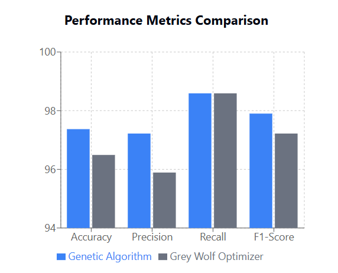
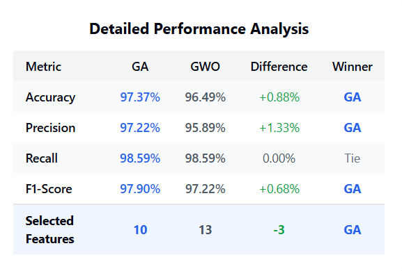

# Wolves-Vs-Genes

### Feature Selection with GA and GWO on Breast Cancer Dataset
This project compares Genetic Algorithm (GA) and a simple binary Grey Wolf Optimizer (GWO) for feature selection on the Breast Cancer Wisconsin dataset using a neural network classifier.

### Highlights
- Data: Breast Cancer dataset from scikit-learn, standardized and split 80/20.

- Model: Simple 3-layer feedforward neural network (Keras).

- GA: Uses DEAP library for evolving feature subsets to maximize accuracy.

- GWO: Custom binary version to select features based on accuracy.

- Evaluation: Accuracy, precision, recall, F1-score reported for selected features.

### Result 

